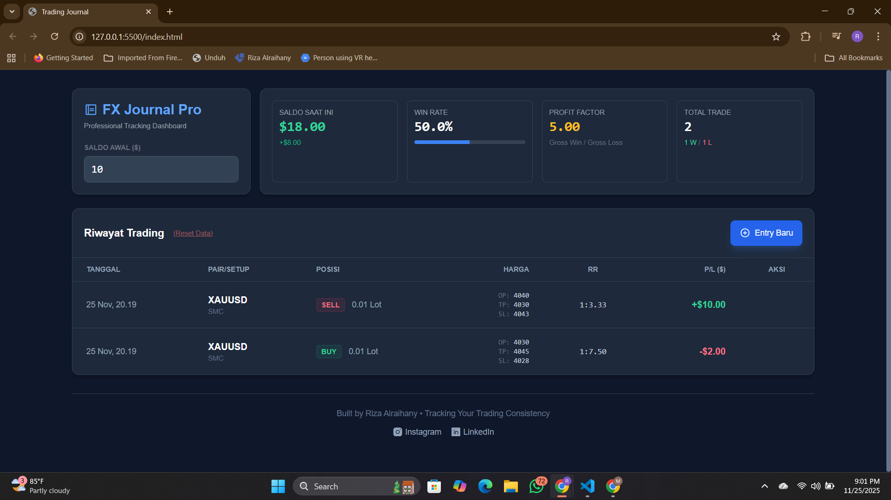

# 📘 FX Journal Pro

**Professional Forex Trading Journal**

FX Journal Pro adalah aplikasi web modern yang dirancang untuk membantu trader mencatat, melacak, dan menganalisis performa trading secara profesional. Dibangun sepenuhnya menggunakan teknologi front-end tanpa backend, sehingga ringan, cepat, dan dapat digunakan di perangkat apa pun.

---

## 🌐 Live Demo

<a href="https://rizaalraihany.github.io/fx-journal-pro/">Klik di sini untuk mencoba aplikasi</a>

---

## ✨ Fitur Utama

### 📊 Dashboard Statistik Real-Time

- Menampilkan saldo awal dan saldo saat ini
- Win rate otomatis berdasarkan histori trade
- Total trade, detail W/L
- Profit Factor (Gross Profit / Gross Loss)

### 📈 Analisis Risk–Reward (RR)

- Menghitung nilai RR otomatis untuk setiap entri
- Menampilkan detail harga OP, TP, dan SL

### 🤖 Algoritma P/L Cerdas

- Menangani pasangan Forex standar
- Pair JPY
- Instrumen emas (XAUUSD)

### 💾 Persistent Data

- Semua data tersimpan otomatis pada browser melalui `localStorage`
- Aman dari refresh atau restart browser

### 📱 Responsif untuk Semua Perangkat

- Desain mobile-friendly
- Tampilan optimal untuk desktop maupun smartphone

---

## 💻 Teknologi yang Digunakan

- **HTML5** — struktur halaman
- **Tailwind CSS** — styling modern dan cepat
- **Alpine.js** — reaktivitas data & state management minimalis
- **SPA (Single Page Application)** — tidak memerlukan server atau database

---

## 🚀 Cara Menjalankan Secara Lokal

### 1. Clone Repository

```bash
# Ganti URL berikut dengan URL repository Anda sendiri
git clone https://github.com/username/nama-repo-anda.git
```

### 2. Buka File Utama

- Masuk ke folder hasil clone
- Jalankan file **ForexJournalPro.html** langsung di browser apa pun (Chrome, Firefox, Edge, dll.)

Tidak memerlukan instalasi, server, atau konfigurasi apa pun.

---

## 🌐 Deploy ke GitHub Pages

Anda dapat mempublikasikan aplikasi ini agar bisa diakses melalui link online.

1. Pastikan file **ForexJournalPro.html** berada di root repository
2. Buka **GitHub → Settings → Pages**
3. Pada _Source_, pilih:

   - **Deploy from a branch**
   - Branch: `main` (atau `master`)
   - Folder: `/` (root)

4. Klik **Save**

GitHub akan menghasilkan URL seperti:

```
https://username.github.io/nama-repo-anda/
```

Gunakan link ini untuk membuka jurnal Anda dari HP maupun PC.

---

## 📸 Cuplikan Tampilan (Preview)

Tampilan dashboard aplikasi:



---

## 🔗 Kontak Pengembang

**Built by Riza Alraihany — Tracking Your Trading Consistency**

Instagram: `@maripos______`
LinkedIn: `Riza Alraihany`

---

Jika Anda ingin menambahkan fitur baru atau memperluas sistem jurnal ini, feel free untuk membuat issue atau melakukan pull request. Terima kasih telah menggunakan FX Journal Pro! 🎉
